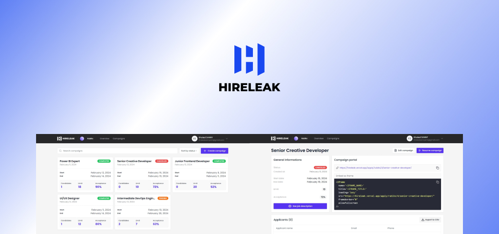

<br/>
<br/>
<div align="center">
  <a href="https://hireleak.vercel.app">
    
  </a>
  <h3 align="center">Hireleak</h3>
  <p align="center">
    An AI-Powered Applicant Tracking System to help process.
    <br />
    <br />
    <a href="https://hireleak.vercel.app">Learn more about Hireleak</a>
    ·
    <a href="https://hireleak.vercel.app/sign-in">Try Hireleak</a>
  </p>
</div>
<br/>

## About Hireleak

Hireleak is a simple and opinionated Applicant Tracking System (ATS) powered by AI software designed to streamline and optimize your recruitment efforts.

<div align="center">

</div>
<br/>

## Features

- 🤖 **AI-Powered Candidate Evaluation:** Utilize AI algorithms to analyze resumes and rank candidates based on customizable acceptance criteria, ensuring efficient screening of applicants.

- 📥 **Embedded Application Form:** Seamlessly embed the applicant submission form on organization websites using an iframe tag, providing a unified application experience for candidates and simplifying the application process.

- 📈 **Real-Time Applicant Tracking and Collaboration:** Track applicant submissions in real-time and facilitate collaboration among recruiters within the organization through a centralized workspace, streamlining communication and decision-making.

## Getting started

To get started with this project:

```bash
  git clone https://github.com/monlasan/Hireleak-ATS.git
```

and copy the .env.sample variables into a separate .env file, fill them out and following run the commands:

```bash
  yarn install
  yarn dev
  yarn build
```

## Tech stack

- NextJS / React
- Supabase
- LangchainJS
- OpenAI
- VercelAI SDK
- ShadCN UI
- Tailwind CSS

## Contributing

Contributions are welcome! Please follow the contribution guidelines when making changes to the project.

## License

This project is licensed under the MIT License.

## Contact

[@monlasan](https://twitter.com/monla_san)
